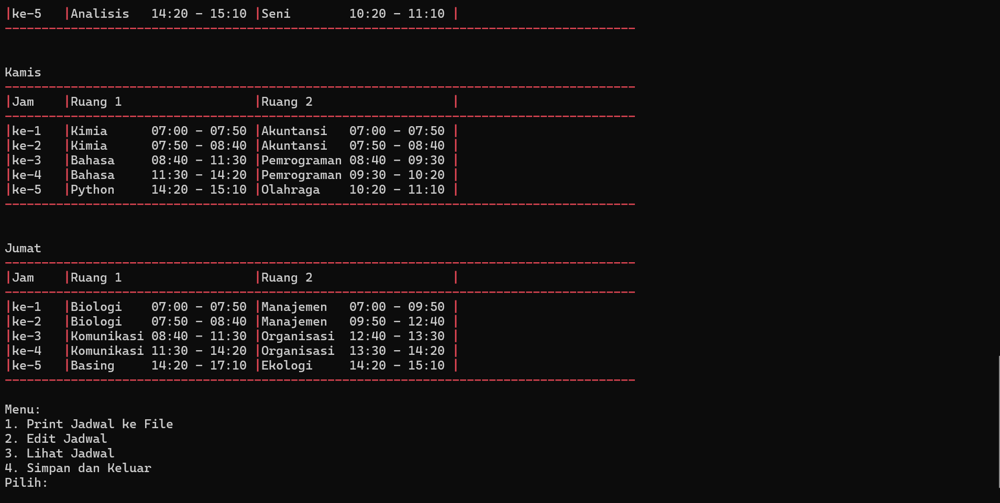

# Automatic School Schedule Generator

### Create an optimized and automatic schedule for courses effortlessly with **Automatic School Schedule Generator**! 🕒📚

This program uses fundamental algorithms to automatically schedule courses based on your input. Built in **C**, it delivers reliability and precision, and the output is a `.exe` file ready to use on any supported platform.


## 🌟 Features
1. **Automatic Scheduling**: Generate schedules with minimal input.
2. **Platform Compatibility**: Works seamlessly on Windows, Linux, and macOS.
3. **Customizable Options**:
   - Define daily time slots and available rooms.
   - Add, edit, or remove schedules as needed.
4. **Export Functionality**: Save your schedules as `.txt` files for easy sharing or review.
5. **User-Friendly Interface**: Simple console-based inputs with clear instructions.

---

## 📘 User Guide

For a detailed walkthrough, refer to the **[User Manual Book](https://undipmail-my.sharepoint.com/:b:/g/personal/lisayihaa_lecturer_undip_ac_id/EZXZFzquoCxAqRklGqyisVcBFBRizdiKFvGGQdpksGPEIw?e=GpvYhW)**.

### Quick Steps:
1. Prepare an input file in `.txt` format with the following structure:
- **Example Input (`newData.txt`):**
  ```
  Physics 2 t
  Physics 2 p
  ```
  `t` = Theory | `p` = Practical

2. Ensure the input file and the program (`program.exe`) are in the same directory.  

3. Run the program and follow the prompts:
- Input the desired number of hours per day.
- Enter the number of rooms available.
- Load your input file.
- Choose from menu options:
  1. Export the schedule.
  2. Edit schedules (Add, Remove, Move).
  3. View generated schedules.
4. Save the schedule and exit. 🎉

## 💻 Preview


---

## ⚡ Technical Details

### System Requirements:
- Operating Systems: Windows, Linux, macOS
- Input Format: `.txt`
## 📜 License
Copyright (c) 2024 Lisa Yihaa R, Megarini H., Dennis R., M. Yusuf, Nurmansya A., Yusa Agusti

Permission is hereby granted, free of charge, to any person obtaining a copy of this software 
and associated documentation files (the "Software"), to deal in the Software without restriction, 
including without limitation the rights to use, copy, modify, merge, publish, distribute, 
sublicense, and/or sell copies of the Software, and to permit persons to whom the Software is 
furnished to do so, subject to the following conditions:

The above copyright notice and this permission notice shall be included in all copies or 
substantial portions of the Software.

THE SOFTWARE IS PROVIDED "AS IS", WITHOUT WARRANTY OF ANY KIND, EXPRESS OR IMPLIED, INCLUDING 
BUT NOT LIMITED TO THE WARRANTIES OF MERCHANTABILITY, FITNESS FOR A PARTICULAR PURPOSE AND 
NONINFRINGEMENT. IN NO EVENT SHALL THE AUTHORS OR COPYRIGHT HOLDERS BE LIABLE FOR ANY CLAIM, 
DAMAGES OR OTHER LIABILITY, WHETHER IN AN ACTION OF CONTRACT, TORT OR OTHERWISE, ARISING FROM, 
OUT OF OR IN CONNECTION WITH THE SOFTWARE OR THE USE OR OTHER DEALINGS IN THE SOFTWARE.

## 👩‍💻 Authors & Contributors  
- Lisa Yihaa R.  
- Megarini H.  
- Dennis R.  
- M. Yusuf  
- Nurmansya A.  
- Yusa Agusti  
